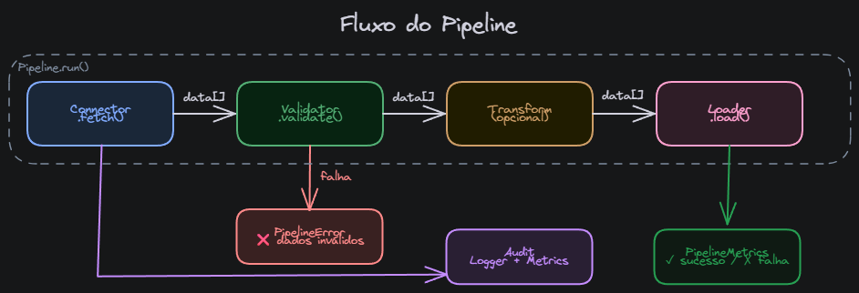
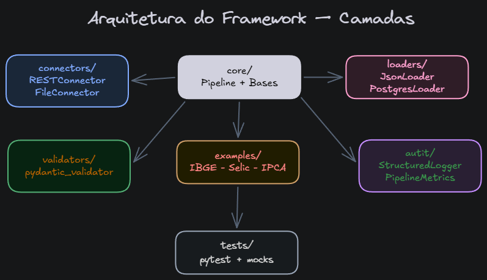
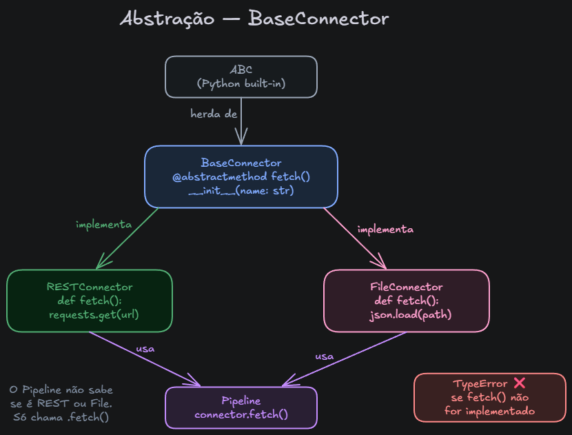

# modular-ingestion-framework

Framework Python para pipelines de ingestão de dados com arquitetura modular e componentes plugáveis — conectores, validadores e loaders intercambiáveis sem alterar o código do pipeline.

```
fetch → validate → transform → load
  ↑          ↑         ↑         ↑
connector  validator transformer loader
  (REST,    (Pydantic) (FieldMapper, (JSON,
  File)                Enrich,      PostgreSQL)
                        Filter, etc)
```



---

## Motivação

Em projetos com muitas fontes de dados, cada pipeline tende a reinventar a roda: retry, logging, validação, tratamento de erros. Este framework resolve isso com uma base comum — você implementa apenas a lógica específica de cada fonte. O `Pipeline` orquestra o resto.

Inspirado em padrões usados em plataformas de dados de alta volumetria para separar responsabilidades e facilitar extensão sem modificar código existente.

---

## Instalação

O projeto usa Poetry para gerenciamento de dependências. Após clonar o repositório:

```bash
git clone https://github.com/wesleyolvr/modular-ingestion-framework
cd modular-ingestion-framework
poetry install
```

Para usar o PostgreSQL loader, instale também as dependências opcionais:

```bash
poetry install --with postgres
```

**Requisitos:**
- Python 3.11+
- Poetry (gerenciador de dependências)

**Dependências principais:**
- `requests` — requisições HTTP
- `pydantic` — validação de dados
- `pandas` — leitura de arquivos Excel
- `openpyxl` — suporte a arquivos .xlsx
- `psycopg2-binary` — PostgreSQL (opcional, grupo `postgres`)

---

## Uso rápido

```python
from pydantic import BaseModel
from core.pipeline import Pipeline
from connectors.rest_connector import RESTConnector
from validators.pydantic_validator import PydanticValidator
from loaders.json_loader import JsonLoader

class Municipio(BaseModel):
    id: int
    nome: str

pipeline = Pipeline(
    name="municipios_ibge",
    connector=RESTConnector(
        name="ibge_api",
        url="https://servicodados.ibge.gov.br/api/v1/localidades/estados/PI/municipios",
    ),
    validator=PydanticValidator(model=Municipio, unique_by="id"),
    loader=JsonLoader(path="output/municipios.json"),
)

metrics = pipeline.run()
print(metrics)
# PipelineMetrics(✓ municipios_ibge | fetched=224 loaded=224 duration=0.48s)
```

**Com transformação usando transformers:**

```python
from transformers import IBGETransformer, TransformPipeline, FilterTransformer, EnrichTransformer

# Usando transformer individual
pipeline = Pipeline(
    name="municipios_ibge",
    connector=RESTConnector(...),
    validator=PydanticValidator(...),
    loader=JsonLoader(...),
    transform=IBGETransformer(),  # Transformer específico para IBGE
)

# Ou compondo múltiplos transformers
transform_pipeline = TransformPipeline([
    IBGETransformer(),
    FilterTransformer(condition=lambda r: r["id"] > 1000),
    EnrichTransformer(fields={"fonte": "API_IBGE"}, add_timestamp=True),
])

pipeline = Pipeline(
    name="municipios_ibge",
    connector=RESTConnector(...),
    validator=PydanticValidator(...),
    loader=JsonLoader(...),
    transform=transform_pipeline,  # Pipeline de transformers
)
```

**Com função customizada (também suportado):**

```python
def transform_municipios(data: list[dict]) -> list[dict]:
    """Extrai apenas campos relevantes."""
    return [{"id": m["id"], "nome": m["nome"]} for m in data]

pipeline = Pipeline(
    name="municipios_ibge",
    connector=RESTConnector(...),
    validator=PydanticValidator(...),
    loader=JsonLoader(...),
    transform=transform_municipios,  # Função callable também funciona
)
```

---

## Exemplos

### Exemplo 1 — API do IBGE

```bash
# Com Poetry (recomendado)
poetry run python examples/pipeline_ibge.py

# Ou diretamente (após poetry install)
python examples/pipeline_ibge.py
```

Busca os 224 municípios do Piauí via API pública do IBGE, valida schema e tipos usando `PydanticValidator`, aplica transformação para extrair campos relevantes, e salva em JSON local.

**Nota:** O exemplo usa `Municipio_IBGE` de `core.models.py` e inclui uma função `transform_municipios` para estruturar os dados da API.

### Exemplo 2 — Usando Transformers

```bash
poetry run python examples/pipeline_with_transformers.py
```

Demonstra uso de transformers individuais e `TransformPipeline` para compor múltiplas transformações em sequência.

---

## Componentes



### Connectors

| Classe | Descrição |
|---|---|
| `RESTConnector` | APIs REST (GET/POST) com suporte a Bearer token, API Key, headers customizados, params e timeout configurável |
| `FileConnector` | Arquivos locais: CSV, JSON, JSONL, XLSX (via pandas/openpyxl) |

### Validators

| Classe | Descrição |
|---|---|
| `PydanticValidator` | Validação completa usando Pydantic: schema, tipos, constraints, duplicatas e validações customizadas |

### Transformers

| Classe | Descrição |
|---|---|
| `FieldMapper` | Mapeia/renomeia campos, suporta campos aninhados via notação "a.b.c" |
| `EnrichTransformer` | Adiciona campos fixos e timestamp opcional aos registros |
| `FilterTransformer` | Filtra registros baseado em função de condição |
| `TransformPipeline` | Compõe múltiplos transformers em sequência |
| `IBGETransformer` | Transformer específico para dados da API do IBGE |
| `SelicTransformer` | Transformer específico para dados da API BCB (Selic) |

### Loaders

| Classe | Descrição |
|---|---|
| `JsonLoader` | Salva em arquivo JSON local (overwrite) com indentação configurável |
| `PostgresLoader` | INSERT ou UPSERT em PostgreSQL via `execute_batch` (psycopg2). Suporta `conflict_on` para definir campos de conflito no UPSERT |

---

## Estendendo o framework



Criar um novo conector em 3 passos:

```python
from core.base_connector import BaseConnector

class MyAPIConnector(BaseConnector):
    def fetch(self) -> list[dict]:
        # sua lógica aqui
        return data
```

O mesmo padrão vale para validadores, transformers e loaders. O `Pipeline` aceita qualquer implementação das interfaces base.

**Criar um novo transformer:**

```python
from transformers.base_transformer import BaseTransformer

class MyTransformer(BaseTransformer):
    def transform(self, data: Any) -> Any:
        # sua lógica de transformação aqui
        return transformed_data
```

Transformers podem ser usados diretamente no Pipeline ou compostos em um `TransformPipeline`.

---

## Métricas e logging

Cada execução retorna um `PipelineMetrics` (modelo Pydantic com validações):

```python
class PipelineMetrics(BaseModel):
    pipeline: str
    success: bool = False
    records_fetched: int = Field(default=0, ge=0)
    records_loaded: int = Field(default=0, ge=0)
    records_failed: int = Field(default=0, ge=0)
    duration_seconds: float = Field(default=0.0, ge=0)
    started_at: datetime
    finished_at: datetime | None = None
    stage_failed: str | None = None
    error_message: str | None = None
```

**Exemplo de saída:**
```python
metrics = pipeline.run()
print(metrics)
# PipelineMetrics(✓ municipios_ibge | fetched=224 loaded=224 duration=0.48s)
```

**Logging estruturado em JSON** — compatível com Datadog, CloudWatch e ELK:

- **Terminal (TTY)**: JSON colorido para facilitar leitura durante desenvolvimento
- **Redirecionamento/arquivo**: JSON puro para ingestão em sistemas de observabilidade

```json
{
  "timestamp": "2025-03-09T14:22:31.123456+00:00",
  "level": "INFO",
  "message": "pipeline_finished",
  "pipeline": "municipios_ibge",
  "status": "success",
  "duration": 0.48,
  "records_fetched": 224,
  "records_loaded": 224
}
```

O logger detecta automaticamente se está em um terminal e aplica cores. Use `setup_logging(use_colors=False)` para forçar JSON puro.

---

## Testes

```bash
# Executar todos os testes
poetry run pytest -v

# Com cobertura de código
poetry run pytest --cov=core --cov=validators --cov=connectors --cov=loaders --cov=transformers --cov=audit --cov-report=term-missing
```

**Cobertura atual (82% geral):**
- ✅ `Pipeline` (89%) — testes de sucesso, falhas de validação, erros de conector, transformações
- ✅ `PydanticValidator` (89%) — validação de schema, tipos, constraints, campos opcionais, validadores customizados, detecção de duplicatas (`unique_by`)
- ✅ `RESTConnector` (89%) — requisições GET/POST, autenticação, headers, params, timeout
- ✅ `FileConnector` (71%) — leitura de CSV, JSON, JSONL, tratamento de erros
- ✅ `JsonLoader` (100%) — escrita de JSON, criação de diretórios, encoding
- ✅ `PostgresLoader` (93%) — INSERT/UPSERT, geração de SQL, tratamento de erros
- ✅ `Transformers` (86-100%) — FieldMapper, EnrichTransformer, FilterTransformer, TransformPipeline, IBGETransformer, SelicTransformer
- ✅ `PipelineMetrics` (100%) — validações Pydantic, representação, conversão
- ✅ `Exceptions` (100%) — PipelineError, ValidationError

**Estrutura de testes:**
- `tests/test_core/` — Pipeline, exceptions
- `tests/test_validators/` — PydanticValidator
- `tests/test_connectors/` — RESTConnector, FileConnector
- `tests/test_loaders/` — JsonLoader, PostgresLoader
- `tests/test_transformers/` — Todos os transformers
- `tests/test_audit/` — PipelineMetrics

**Total:** 118 testes passando

---

## Estrutura

```
modular-ingestion-framework/
├── core/
│   ├── __init__.py
│   ├── base_connector.py    # ABC — interface para conectores
│   ├── base_validator.py    # ABC — interface para validadores
│   ├── base_loader.py       # ABC — interface para loaders
│   ├── pipeline.py          # Orquestrador: fetch → validate → transform → load
│   ├── exceptions.py        # PipelineError, ValidationError
│   └── models.py            # Modelos Pydantic de exemplo (Municipio_IBGE, Produto, etc)
├── connectors/
│   ├── __init__.py
│   ├── rest_connector.py    # REST GET/POST com auth headers, params, timeout
│   └── file_connector.py    # CSV, JSON, JSONL, XLSX (via pandas)
├── validators/
│   ├── __init__.py
│   └── pydantic_validator.py  # Validação completa com Pydantic + unique_by
├── loaders/
│   ├── __init__.py
│   ├── json_loader.py       # Arquivo JSON local
│   └── postgres_loader.py   # INSERT / UPSERT PostgreSQL (psycopg2)
├── transformers/
│   ├── __init__.py
│   ├── base_transformer.py  # ABC — interface para transformers
│   ├── field_mapper.py      # Mapeamento de campos (inclui aninhados)
│   ├── enrich_transformer.py # Adiciona campos fixos e timestamp
│   ├── filter_transformer.py # Filtra registros por condição
│   ├── transform_pipeline.py # Compõe múltiplos transformers
│   ├── ibge_transformer.py  # Transformer específico IBGE
│   └── selic_transformer.py # Transformer específico BCB Selic
├── audit/
│   ├── logger.py            # JSON structured logging com cores (ColoredJsonFormatter)
│   └── metrics.py           # PipelineMetrics (Pydantic BaseModel)
├── examples/
│   ├── pipeline_ibge.py           # Pipeline completo com API IBGE + transform
│   └── pipeline_with_transformers.py # Exemplos de uso de transformers
├── scripts/                 # Scripts de exploração e testes
│   ├── pipeline_ibge.py
│   ├── explorando_*.py
│   └── README.md            # Guia sobre execução de scripts
├── tests/
│   ├── __init__.py
│   ├── test_core/
│   │   ├── __init__.py
│   │   └── test_pipeline.py
│   ├── test_validators/
│   │   ├── __init__.py
│   │   └── test_validators.py
│   ├── test_connectors/
│   │   ├── __init__.py
│   │   └── test_connectors.py
│   ├── test_loaders/
│   │   ├── __init__.py
│   │   └── test_loaders.py
│   ├── test_transformers/
│   │   ├── __init__.py
│   │   └── test_transformers.py
│   └── test_audit/
│       ├── __init__.py
│       └── test_metrics.py
├── pyproject.toml          # Configuração Poetry + pytest
└── poetry.lock             # Lock file das dependências
```

---

## Decisões de design

- **Interfaces via ABC + `@abstractmethod`** — garante contrato explícito entre componentes (Liskov Substitution Principle)
- **Validação antes da transformação** — falha rápida antes de qualquer I/O de escrita
- **Strategy Pattern** — conectores, validadores, transformers e loaders são intercambiáveis sem alterar o pipeline
- **Template Method** no `Pipeline` — o fluxo é fixo (`fetch → validate → transform → load`), os passos são plugáveis
- **Transformers modulares** — componentes reutilizáveis para transformações comuns (mapeamento, filtro, enriquecimento)
- **Composição de transformers** — `TransformPipeline` permite encadear múltiplas transformações
- **Logging estruturado em JSON** — pronto para ingestão em sistemas de observabilidade (Datadog, CloudWatch, ELK)
- **Métricas com Pydantic** — validação automática de tipos e constraints (ex: `records_loaded` não pode ser maior que `records_fetched`)
- **Logger adaptativo** — detecta TTY e aplica cores automaticamente; JSON puro quando redirecionado
- **Tratamento de erros** — exceções customizadas (`PipelineError`, `ValidationError`) com contexto de falha por estágio

---

## Roadmap

- [ ] `S3Connector` — leitura de arquivos no AWS S3 via boto3
- [ ] `KafkaLoader` — publicação em tópico Kafka
- [ ] GitHub Actions — CI com pytest em push
- [ ] `AsyncPipeline` — versão assíncrona com `asyncio`

---

## Autor

**Wesley de Oliveira** — Engenheiro de Dados / Software Engineer  
[linkedin.com/in/wesleyolvr](https://linkedin.com/in/wesleyolvr) · [github.com/wesleyolvr](https://github.com/wesleyolvr)
